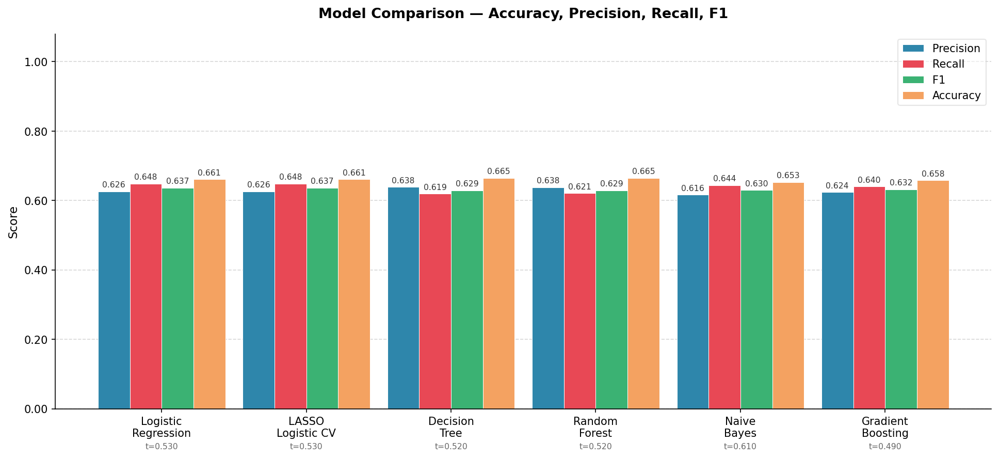
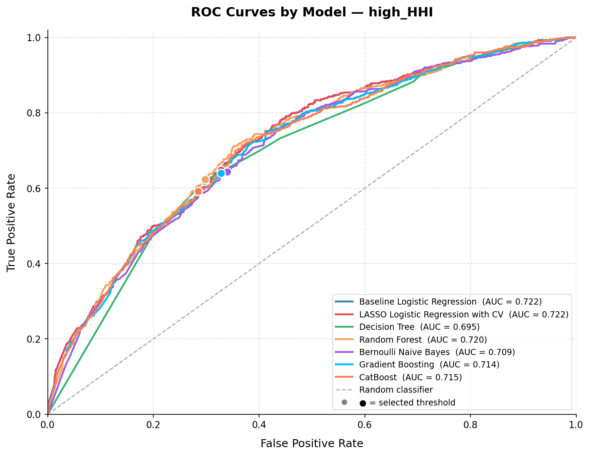
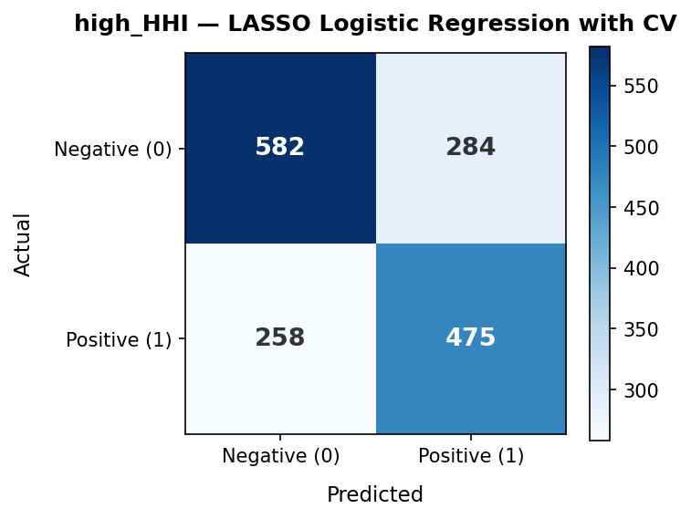
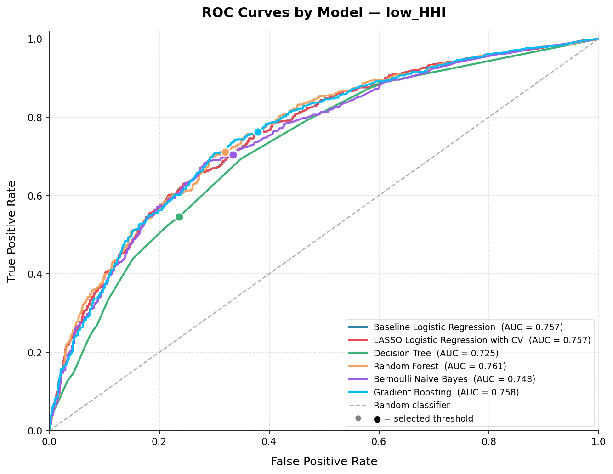
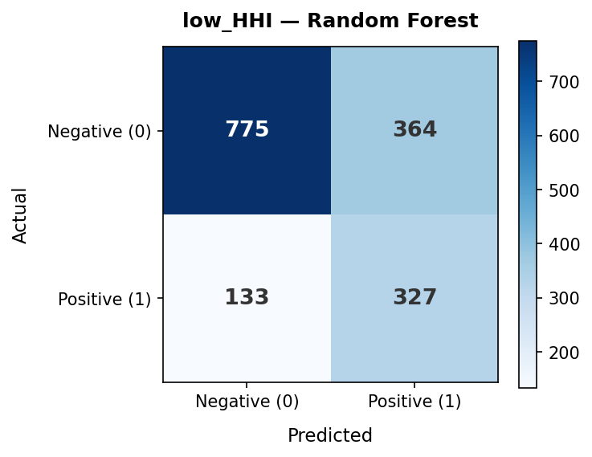

# Using Financial Knowledge Measures to Predict Household Financial Vulnerability
# I. Problem Statement and Motivation
This project attempts to explore whether financial knowledge measures can predict different forms of household financial vulnerability, including poverty status, fraud exposure, household income, savings, and income volatility. The motivation is that financial well-being is not only about income, but also about whether households can manage day-to-day finances, absorb shocks, and avoid harmful financial outcomes. The CFPB National Financial Well-Being Survey is well suited for this question because it includes measures of financial knowledge, financial skill, financial behavior, income, savings, safety nets, and financial experiences for a national sample of U.S. adults. In this project, we use financial knowledge, numeracy, and self-assessed knowledge variables to build classification models for several vulnerability outcomes, then compare whether interpretable models such as logistic regression perform similarly to more flexible machine learning models such as random forests and gradient boosting

## II. Data

### Data Source and Collection

For this project, we use the Consumer Financial Protection Bureau’s National Financial Well-Being Survey Public Use File. The survey was conducted online in English and Spanish between October and December 2016 and includes 6,394 completed responses from U.S. adults. The sample was drawn from GfK’s KnowledgePanel and was designed to represent the adult population of the 50 U.S. states and Washington, D.C., with an additional oversample of adults aged 62 and older. The dataset includes survey responses collected by the CFPB as well as pre-existing panel information on respondents, such as household income, poverty status, and demographic characteristics.

### Data Summary and Relevant Variables

Our analysis focuses on whether financial knowledge measures can predict several household financial vulnerability outcomes. The main predictor variables include the Lusardi-Mitchell financial knowledge items (`FK1correct`, `FK2correct`, `FK3correct`), the Knoll-Houts financial knowledge items (`KH1correct` to `KH9correct`), objective numeracy items (`ON1correct`, `ON2correct`), and self-assessed financial knowledge (`SUBKNOWL1`). The target variables are constructed as binary classification outcomes, including poverty status, fraud exposure, household income, savings level, and income volatility. These outcomes capture different dimensions of financial vulnerability, from low income and low savings to unstable income and exposure to financial fraud.

A more detailed description of the dataset, survey design, variable definitions, and codingA more detailed description of the dataset, survey design, variable definitions, and coding rules can be found in the official CFPB documentation and codebook, saved in this repository as `data/user_guide.pdf`.

### Limitations of Data

The data are cross-sectional, so the models should be interpreted as predictive rather than causal. The survey measures associations between financial knowledge and financial vulnerability, but it cannot prove that financial knowledge causes better or worse financial outcomes. Some variables are self-reported, which may introduce measurement error or recall bias, especially for sensitive topics such as income, savings, and fraud exposure. The dataset also includes nonsubstantive response codes such as refusal, “don’t know,” and “prefer not to say,” so these values need to be handled carefully during cleaning. Finally, this project mainly uses financial knowledge variables as predictors, so the models intentionally leave out many potentially important factors such as demographics, employment, household structure, and broader financial behavior.

## III. Modeling Approach

### Classification Targets

This project treats each financial vulnerability outcome as a separate binary classification problem. The five main targets are poverty status, fraud exposure, household income, savings, and income volatility. For each target, the outcome is coded so that `1` represents the financial condition of interest, such as being below a selected income threshold, reporting fraud exposure, having lower savings, or experiencing more income volatility. Each target is modeled separately using the same set of financial knowledge, numeracy, and self-assessed knowledge predictors.

### Models Compared

We compare several supervised classification models: logistic regression, LASSO logistic regression with cross-validation, decision tree, random forest, Bernoulli Naive Bayes, gradient boosting, and CatBoost. Logistic regression is used as the main interpretable baseline because its coefficients are easy to explain. LASSO logistic regression is included for variable selection and regularization. Decision tree, random forest, gradient boosting, and CatBoost are included to test whether nonlinear relationships improve predictive performance. Bernoulli Naive Bayes is included as a simple comparison model for the binary financial knowledge variables. CatBoost is included as an extension model because it is a strong gradient boosting method for tabular data, although it is not the main baseline model.

### Evaluation Metrics

Model performance is evaluated using accuracy, balanced accuracy, ROC AUC, precision, recall, F1 score, and confusion matrices. Because several target variables are imbalanced, accuracy alone can be misleading. For that reason, the main comparison emphasizes ROC AUC, balanced accuracy, recall, and F1 score. ROC AUC measures how well the model ranks positive cases above negative cases, while balanced accuracy accounts for performance on both classes. Precision, recall, and F1 score are used to evaluate how well each model identifies the positive class for each financial vulnerability target.

### Cross-Validation and Threshold Tuning

The data are split into a training set and a held-out test set. When threshold tuning is used, the classification threshold is selected using cross-validation within the training set only. After the threshold is chosen, the model is refit on the full training set and evaluated once on the test set. This avoids using the test set to make modeling decisions. The default threshold tuning metric is balanced accuracy, since it gives weight to both classes and is more appropriate when outcomes are imbalanced.

## IV. Analysis and Results
### Federal Poverty Status

- Model comparison table

- ROC AUC visualization

- Confusion matrix for recommended/best model

- Feature importances (maybe)

### Fraud Exposure

- Model comparison table

- ROC AUC visualization

- Confusion matrix for recommended/best model

- Feature importances (maybe)

### Household Income
#### High Household Income 

- Model comparison table

| Model | Threshold | Accuracy | ROC AUC | Balanced Accuracy | Precision | Recall | F1 |
|-------|-----------|----------|---------|-------------------|-----------|--------|----|
| Baseline Logistic Regression | 0.53 | 0.6610 | 0.7222 | 0.6600 | 0.6258 | 0.6480 | 0.6367 |
| LASSO Logistic Regression with CV | 0.53 | 0.6610 | 0.7222 | 0.6600 | 0.6258 | 0.6480 | 0.6367 |
| Decision Tree | 0.52 | 0.6648 | 0.6954 | 0.6613 | 0.6385 | 0.6194 | 0.6288 |
| Random Forest | 0.52 | 0.6648 | 0.7204 | 0.6614 | 0.6381 | 0.6207 | 0.6293 |
| Bernoulli Naive Bayes | 0.61 | 0.6529 | 0.7090 | 0.6522 | 0.6162 | 0.6439 | 0.6298 |
| Gradient Boosting | 0.49 | 0.6579 | 0.7143 | 0.6565 | 0.6237 | 0.6398 | 0.6316 |
| CatBoost | 0.51 | 0.6592 | 0.7146 | 0.6540 | 0.6382 | 0.5921 | 0.6143 |

- ROC AUC visualization

- Confusion matrix for recommended/best model

- Feature importances (maybe)

#### Low Household Income

- Model comparison table

| Model | Threshold | Accuracy | ROC AUC | Balanced Accuracy | Precision | Recall | F1 |
|-------|-----------|----------|---------|-------------------|-----------|--------|----|
| Baseline Logistic Regression | 0.45 | 0.6773 | 0.7572 | 0.6860 | 0.4603 | 0.7065 | 0.5575 |
| LASSO Logistic Regression with CV | 0.45 | 0.6773 | 0.7572 | 0.6860 | 0.4603 | 0.7065 | 0.5575 |
| Decision Tree | 0.52 | 0.7098 | 0.7247 | 0.6544 | 0.4959 | 0.5239 | 0.5095 |
| Random Forest | 0.49 | 0.6892 | 0.7613 | 0.6956 | 0.4732 | 0.7109 | 0.5682 |
| Bernoulli Naive Bayes | 0.18 | 0.6767 | 0.7483 | 0.6849 | 0.4596 | 0.7043 | 0.5562 |
| Gradient Boosting | 0.24 | 0.6623 | 0.7584 | 0.6923 | 0.4488 | 0.7630 | 0.5652 |
| CatBoost | 0.25 | 0.6748 | 0.7593 | 0.7005 | 0.4605 | 0.7609 | 0.5738 |

- ROC AUC visualization

- Confusion matrix for recommended/best model

- Feature importances (maybe)

### Savings

- Model comparison table

- ROC AUC visualization

- Confusion matrix for recommended/best model

- Feature importances (maybe)

### Financial Volatility

- Model comparison table

- ROC AUC visualization

- Confusion matrix for recommended/best model

- Feature importances (maybe)

## V. Recommended Model(s) and Conclusions

## VI. Modeling Limitations and Potential Extensions
### Limitations
The modeling framework is subject to several sources of bias that may affect classification performance. Because the analysis is designed to test whether financial knowledge predicts these outcomes, the predictor set consists entirely of financial knowledge quiz items, introducing omitted variable bias. Important demographic, behavioral, and cognitive factors such as age, income, or memory constraints are excluded despite likely being correlated with both the predictors and outcomes. This risks overstating the role of financial knowledge in explaining outcomes like fraud victimization or savings behavior. There is also potential sample selection bias depending on how the underlying survey data was collected and filtered, which may limit the generalizing the findings to broader populations. Additionally, measurement error in self-reported survey responses may introduce noise and reduce the clarity of class boundaries, making it more difficult for the models to accurately distinguish between classes.

On the modeling side, hyperparameters are fixed at reasonable defaults rather than systematically tuned. The target variables are constructed using somewhat arbitrary thresholds to define class membership which makes the results sensitive to alternative labeling choices. Separately, classification thresholds used to convert predicted probabilities into class predictions are selected via cross-validation to optimize a chosen performance metric. While this improves predictive performance, it may bias results toward that specific metric and may not apply to the broader population. Class imbalance may further skew performance toward the majority class, even when adjustments are applied. Taken together, these limitations suggest that the results should be interpreted as predictive associations rather than evidence of causal effects

### Extensions
Several extensions could address the limitations outlined above and improve both the predictive performance and applicability of the classification framework. First, expanding the feature set to include demographic, behavioral, and cognitive variables such as age, income, and measures of financial behavior would help reduce omitted variable bias and provide a more comprehensive view of the factors influencing outcomes like fraud and savings. This would also improve the model’s ability to generalize across different populations.

Second, the way the target variables are defined could be improved by trying different cutoff values or moving beyond simple binary outcomes. For example, using multiple categories or continuous measures would better capture differences in financial behavior and reduce sensitivity to arbitrary thresholds.

On the modeling side, performance could be improved by more systematically tuning hyperparameters instead of relying on default settings. While the current approach already tunes classification thresholds, this could be expanded by evaluating models across multiple performance metrics or choosing thresholds that better reflect real-world decision tradeoffs. In addition, using stronger validation methods such as k-fold cross-validation or repeated train-test splits could provide more reliable estimates of how the models perform on new data.

## VII. Rerun Instructions
